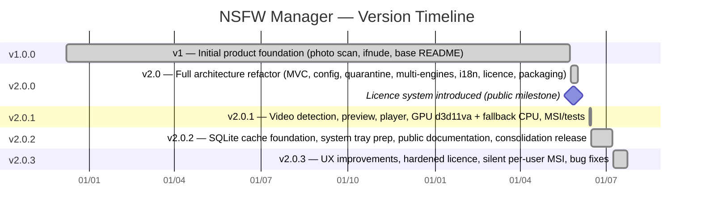

# NSFW Manager — Release History
## Version Index

This document summarizes all public releases of NSFW Manager. Each version has a dedicated page with full changelog details.

---

## Version Timeline

---

## Stable Releases

### v2.0.3 — Latest Stable Release
**July 2026**
Activates the SQLite scan cache, adds right-click context menus, the Properties Panel, configurable double-click actions, keyboard shortcuts, and the hardened licence security system. Introduces the silent per-user MSI installer with no UAC prompt.

Full details: [v2.0.3.md](v2.0.3.md)

---

### v2.0.2 — Consolidation Release
**July 2026**
Focuses on stability, documentation, and the foundational groundwork for the scan cache. The SQLite cache structure was introduced in this release and fully activated in v2.0.3.

Full details: [v2.0.2.md](v2.0.2.md)

---

### v2.0.1 — Video Expansion Release
**June 2026**
First major multimedia extension: video detection, video preview, GPU hardware decoding (d3d11va), automatic CPU fallback, and improved MSI packaging.

Full details: [v2.0.1.md](v2.0.1.md)

---

### v2.0.0 — Architecture Refactor Release
**June 2026**
Complete redesign of the application: new MVC architecture, configuration system, multi-engine support (int8, fp16, onnx, ifnude), licence system, multilingual UI (EN/FR), dark/light themes, and modern packaging.

Full details: [v2.0.0.md](v2.0.0.md)

---

### v1.0.0 — First Public Release
**January 2026**
Initial public version with core scanning, quarantine, delete, and the first MSI installer. Establishes the foundation for the v2 redesign.

Full details: [v1.0.0.md](v1.0.0.md)
